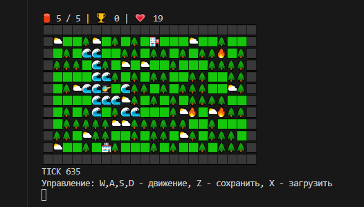
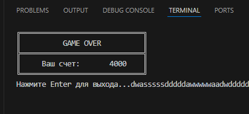

<div align="center">

# 🚁 Вертолетик / Helicopter Game

_**Консольная игра на Python с псевдографикой, где вы управляете вертолетом, тушите пожары и спасаете лес!**_
</div>

__
*Общий вид игровой карты с вертолетом и элементами окружения*

__
*Финальный экран с итоговым счетом после проигрыша*

### [ 🎥 Смотреть видео-геймплей](https://disk.yandex.ru/i/RuIpCTdt8FFiTA)

_Скриншот игрового процесса_

### ✨ Особенности игры

##### 🎮 _Простое управление_ - клавиши W, A, S, D для движения

##### 🔥 *Динамические пожары* - тушите горящие деревья и получайте очки

##### 🌊 *Реки* - пополняйте запас воды для тушения пожаров

##### 🏥 *Госпиталь* - покупайте дополнительные жизни

##### 🏪 *Магазин улучшений* - увеличивайте емкость водного бака

##### ⛅ *Погодная система* - избегайте грозы - ⚡

##### 💾 *Система сохранения* - сохраняйте и загружайте прогрес 

##### 🌲🟩 *Процедурная генерация* - каждый запуск уникальная карта

### 🕹️ Управление

|Клавиша| Действие |
|---------|----------|
| `W` | Движение вверх |
| `A` | Движение влево |
| `S` | Движение вниз |
| `D` | Движение вправо |
| `Z` | Сохранить игру |
| `X` | Загрузить игру |

## 🚀 Установка и запуск
### Требования
* Python 3.7 или выше
* Библиотека pynput
### Пошаговая установка
#### 1. Клонируйте репозиторий:
```
git clone https://github.com/kosu1l1ya/helicopter.git
cd helicopter
```
#### 2.  Установите необходимые зависимости:
```
pip install pynput
```
#### 3. Запустите игру:
```
python main.py
```

### 🎯 Игровой процесс
#### _Основная цель - тушите пожары, собирайте бонусы и избегайте грозовых туч. Наберите как можно больше очков!_

* _**Вода**_ - пролетайте над рекой (🌊), чтобы наполнить бак

* _**Тушение пожаров**_ - подлетайте к горящим деревьям (🔥) с водой в баке

* _**Улучшения**_ - посещайте магазин (🏪) для увеличения емкости бака

* _**Здоровье**_ - покупайте жизни в госпитале (🏥)

* _**Опасности**_ - избегайте грозовых молний (⚡), которые отнимают жизни

### ⭐ Система очков

| Действие | Награда |
|----------|---------|
| 🧯 Тушение пожара | +100 очков |
| ✨ Покупка улучшения | -5000 очков |
| ❤️ Покупка жизни | -1000 очков |

### 💾 Система сохранений

*Игра автоматически сохраняет прогресс при выходе. Также вы можете вручную сохраняться клавишей __Z__ и загружаться клавишей __X__.*

#### _Сохранение включает_:
* Позицию вертолета
* Текущие очки и жизни
* Состояние карты
* Положение облаков и пожаров

### 🛠️ Для разработчиков
_**Структура проекта**_

```
helicopter/
├── main.py          # Главный файл игры
├── helicopter.py    # Класс вертолета
├── map.py           # Класс карты и генерации
├── clouds.py        # Класс облаков и погоды
├── utils.py         # Вспомогательные функции
├── screenshots/     # Папка со скриншотами игры
│ ├── gameplay.png   # Основной скриншот геймплея
│ └── game_over.png  # Скриншот меню
├── savegame.json    # Файл сохранения (создается автоматически)
├── README.md        # Этот файл
└── requirments.txt  # Зависимости проекта
```

_**Настройка параметров игры**_

_Вы можете легко изменить параметры игры, отредактировав константы в файлах:_

В  **map.py**:
```
python
TREE_BONUS = 100      # Очки за тушение пожара
UPGRADE_COST = 5000   # Стоимость улучшения бака
LIFE_COST = 1000      # Стоимость покупки жизни
```
В  **main.py**:
```
python
TICK_SLEEP = 0.05     # Скорость игры
TREE_UPDATE = 50      # Частота появления деревьев
FIRE_UPDATE = 75      # Частота возникновения пожаров
CLOUDS_UPDATE = 100   # Частота обновления облаков
MAP_W, MAP_H = 20, 10 # Размер карты
```

### 🐛 Известные проблемы
* На некоторых системах могут некорректно отображаться эмодзи
* При быстром движении может наблюдаться мерцание экрана
* Сохранения несовместимы между разными версиями игры
